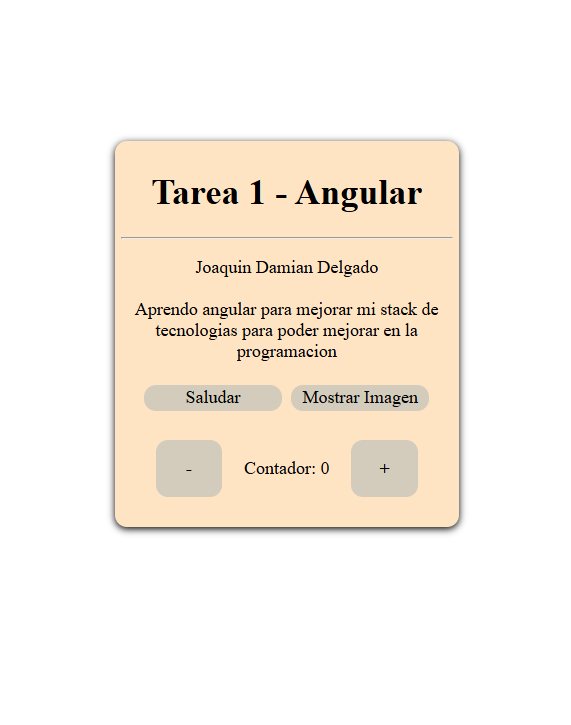

# TAREA 1 - CONOCIENDO ANGULAR

## Descripcion

Este proyecto es una base para conocer Angular, incluyendo su instalación, conceptos fundamentales, creación de componentes y funcionalidades, así como los estilos que ofrece.

## Instrucciones

### 1. Clonar el repositorio

`bash git clone https://github.com/JDamianDelgado/Angular-1.git `

### 2. Instalar dependencias

`npm install`

### 3. Ejecutar la aplicacion

`cd homework-1 `

`npm start`

### Capturas

### Creditos

- Joaquin Damian Delgado
- Diplomatura Desarrollador Full Stack

### Bibliografia

- Curso: Unidad 1 - Módulo 1 UTN - Angular
